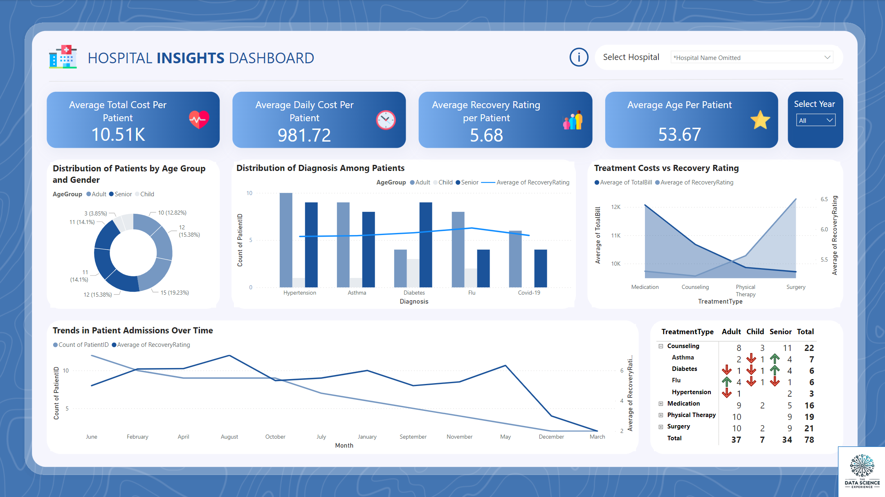

# Hospital Insights Dashboard using Power BI

## Project Overview
This project leverages Power BI to analyze hospital data and generate actionable insights. The goal is to identify key trends, correlations, and patterns in patient demographics, treatment outcomes, and hospital operations. Through interactive and visually engaging dashboards, this analysis supports better decision-making and enhances operational effectiveness in healthcare settings.

## Tools and Skills
- **Power BI**: Utilized for crafting dynamic visualizations and interactive dashboards.
- **Data Analysis**: Conducted in-depth analysis of hospital and patient data to extract valuable insights.
- **Statistical Analysis**: Applied statistical methods to uncover trends and relationships within the data.
- **Healthcare Domain Expertise**: Interpreted results with a strong understanding of healthcare operations and patient care.

## Data Analysis and Visualization
1. **Age Groups and Recovery Rates**:
   - Classified patients into Child, Adult, and Senior groups.
   - Identified that Seniors had the highest recovery rating variability across different treatments.

2. **Cost Analysis Across Treatment Types**:
   - Analyzed average costs associated with various treatments.
   - Noted that surgery incurred the highest average costs per patient.

3. **Gender-Based Diagnosis Distribution**:
   - Explored the distribution of diagnoses by gender.
   - Found that certain conditions were more prevalent in specific genders.

4. **Analysis of Recovery Ratings**:
   - Assessed average recovery ratings for different treatment categories.
   - Counseling exhibited the highest recovery ratings on average.

5. **Hospital Utilization Metrics**:
   - Analyzed hospital admissions and room occupancy rates.
   - Highlighted one hospital with particularly high admission rates and room utilization.

6. **Treatment Effectiveness and Length of Stay**:
   - Correlated treatment effectiveness with patient length of stay.
   - Despite longer stays, certain treatments showed lower recovery ratings.

7. **Hospital Cost Comparisons**:
   - Compared treatment costs across various hospitals.
   - Identified one hospital as having significantly higher costs than others.

8. **Patient Admission Trends Over Time**:
    - Analyzed monthly patient admission trends.
    - Observed a peak in admissions during certain months, correlating with specific diagnoses.

9. **Age-Related Recovery Patterns**:
    - Investigated how age influences recovery ratings.
    - Found that recovery outcomes were consistent across age groups, with no strong age correlation.

10. **Recovery Trends by Demographics**:
    - Analyzed recovery rates by gender and age group.
    - Noted that adults had higher recovery rates and were more frequently admitted.

11. **Hospital Performance and Patient Outcomes**:
    - Evaluated hospitals based on admission rates and recovery performance.
    - Identified a hospital with high admissions but relatively lower recovery ratings.

12. **Cohort Analysis Based on Admission Dates**:
    - Analyzed patient recovery rates on a monthly basis.
    - Found specific months where recovery ratings were lower, possibly due to higher admission volumes.

## Key Findings
1. **Patient Demographics**: Identified significant trends in patient age groups and gender-specific diagnosis patterns.
2. **Treatment Costs**: Provided insights into cost distributions across various treatment categories, highlighting areas for cost optimization.
3. **Hospital Utilization**: Analyzed hospital resource usage, enabling more effective resource management.
4. **Doctors' Impact**: Revealed the influence of individual doctors on patient outcomes, providing opportunities for targeted improvements.
5. **Correlation Analysis**: Explored relationships between patient characteristics and healthcare outcomes, informing data-driven decision-making.

## Takeaways
- Power BI is a powerful tool for healthcare organizations to transform data into meaningful insights, driving improved patient care and operational efficiency.
- Understanding patient demographics and treatment patterns is crucial for optimizing healthcare delivery and resource allocation.
- Data-driven strategies help healthcare providers pinpoint areas for improvement, enabling better-targeted interventions and enhanced patient outcomes.
- Ongoing analysis and monitoring of healthcare data are vital for recognizing trends and proactively addressing challenges in the healthcare industry.

Theme credit to www.datapears.com!
